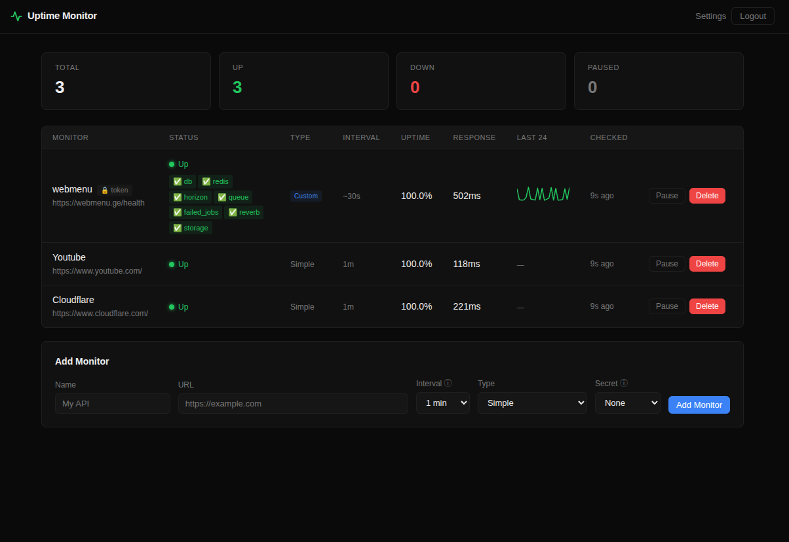

# Uptime Monitor

Know the moment something breaks — before your users do.

This is a fully self-hosted uptime monitor that runs entirely inside your Cloudflare account. It costs nothing to operate (Cloudflare's free tier covers it completely), takes about 10 minutes to deploy, and requires zero ongoing maintenance. There is no server to manage, no database to provision, and no monthly bill to pay.

Every minute, a Cloudflare Worker pings your endpoints and writes the results to KV storage. You can monitor as many domains and services as you like — a mix of production apps, APIs, staging environments, or third-party dependencies — all from a single dashboard. Each monitor has its own check interval, type, and alert configuration. If anything goes down you get a Telegram message within 60 seconds. If it stays down, you get a reminder every minute for up to 5 messages so it does not silently fail in a notification you missed. When it recovers, you get another message with the total downtime duration.

For Laravel applications specifically, it goes much deeper than a simple ping. A companion `/health` route on your app reports the status of each internal service — database, Redis, Horizon, queues, failed jobs, Reverb, and disk storage — as structured JSON. The monitor reads that JSON and shows you exactly which service failed, both in the dashboard and in the Telegram alert. Instead of knowing "the site is down," you know "the site is down because Horizon stopped and there are 47 jobs stuck in the queue."

Everything — monitor config, check history, Telegram settings — is stored in Cloudflare KV. The entire application is a single JavaScript file with no build step and no dependencies beyond Wrangler.



---

## Stack

- **Cloudflare Worker** — vanilla JavaScript, no bundler
- **Cloudflare KV** — stores monitor config, status, and history
- **Cloudflare Cron Trigger** — scheduled checks every minute
- **Telegram Bot API** — up/down alerts

---

## Prerequisites

- [Node.js](https://nodejs.org/) 18+ and npm
- A [Cloudflare account](https://dash.cloudflare.com/sign-up) (free tier is sufficient)
- Wrangler CLI — installed as a dev dependency, no global install needed

---

## Deployment

### 1. Install Wrangler

```bash
npm install
```

This installs Wrangler locally into `node_modules/`. All commands below use `npx wrangler` so no global install is needed. Alternatively, install Wrangler globally once:

```bash
npm install -g wrangler
```

Then replace every `npx wrangler` below with just `wrangler`.

---

### 2. Authenticate Wrangler with Cloudflare

```bash
npx wrangler login
```

A browser window opens. Log in to your Cloudflare account and authorize Wrangler. Your credentials are stored in `~/.wrangler/config/` — you only need to do this once per machine.

To confirm it worked:

```bash
npx wrangler whoami
```

---

### 3. Create a KV namespace

The app uses Cloudflare KV to store monitor config, status history, and settings.

```bash
npx wrangler kv:namespace create "KV"
```

The output looks like:

```
Add the following to your configuration file in your kv_namespaces array:
{ binding = "KV", id = "abc123def456..." }
```

Copy that `id` value and paste it into `wrangler.toml`:

```toml
[[kv_namespaces]]
binding = "KV"
id = "abc123def456..."   # ← replace this
```

> **Preview namespace (optional):** If you want a separate KV namespace for `wrangler dev` (local development), run:
> ```bash
> npx wrangler kv:namespace create "KV" --preview
> ```
> Then add the returned `preview_id` to `wrangler.toml`:
> ```toml
> [[kv_namespaces]]
> binding = "KV"
> id = "abc123def456..."
> preview_id = "xyz789..."
> ```

---

### 4. Set secrets

Secrets are stored encrypted in Cloudflare's vault — they are **never** written to any file. You will be prompted to type (or paste) each value.

**Admin password** — used to log in to the dashboard:

```bash
npx wrangler secret put ADMIN_PASSWORD
```

**Session signing key** — used to HMAC-sign the session cookie. Must be a long, random string:

```bash
npx wrangler secret put SECRET_KEY
```

Generate a suitable value with:

```bash
openssl rand -hex 32
```

> Both secrets can also be set in the [Cloudflare dashboard](https://dash.cloudflare.com/) under **Workers & Pages → your worker → Settings → Variables and Secrets**.

---

### 5. Deploy

```bash
npx wrangler deploy
```

On success you'll see:

```
Deployed uptime-monitor triggers (1 route, 1 cron)
  https://uptime-monitor.<your-subdomain>.workers.dev
```

Open that URL — you should see the login page.

---

### 6. Configure Telegram alerts (optional)

Alerts are configured through the app's own Settings page, not via any config file.

**Create a Telegram bot:**

1. Open Telegram and start a chat with [@BotFather](https://t.me/BotFather)
2. Send `/newbot` and follow the prompts
3. Copy the bot token BotFather gives you (format: `1234567890:AABBccDDeeFFggHH...`)

**Get your chat ID:**

- For a personal chat: start a conversation with your bot, then visit `https://api.telegram.org/bot<TOKEN>/getUpdates` after sending it any message — the `chat.id` field in the JSON is your ID
- For a group: add the bot to the group, send a message, and use the same `getUpdates` URL — group IDs are negative numbers (e.g. `-1001234567890`)

**Configure in the dashboard:**

1. Open your Worker URL and log in
2. Click **Settings** in the header
3. Paste the bot token into the **Bot Token** field
4. Paste one or more chat IDs into the **Chat IDs** field (one per line)
5. Click **Save**
6. Click **Send Test Alert** — you should receive a Telegram message within a few seconds

---

## Monitor Types

### Simple

A standard HTTP check. The monitor sends a GET request to the URL and considers it **up** if the response status is below 400. Use this for any endpoint that just needs to be reachable — a marketing site, an API, a third-party service.

### Custom — Laravel only

> **This type is designed exclusively for Laravel applications.** It will not work correctly with other frameworks unless you implement the exact same JSON response format manually.

A Simple monitor can only tell you a site is down. The Custom type tells you *why*. It calls a `/health` route on your Laravel app that checks each internal service individually and returns the results as structured JSON. The monitor reads that JSON and:

- Marks the monitor **down** if any check returns `"fail"` or the top-level `status` is `"fail"`
- Shows a per-service badge row (✅ / ⚠️ / ❌) directly in the dashboard table
- Includes the full per-service breakdown in every Telegram alert message

So instead of a generic "My App is DOWN" alert, you get:

```
🔴 My App is DOWN
https://myapp.com/health

✅ db
✅ redis
❌ horizon
⚠️ queue · 47 pending
✅ failed_jobs
✅ reverb
✅ storage
```

**JSON format the route must return:**

Each key becomes a named check. Values must follow this convention:

| Value | Meaning |
|-------|---------|
| `"ok"` | Check passed |
| `"fail"` | Check failed — marks the whole monitor down |
| `"warn:<detail>"` | Warning with optional detail (e.g. `"warn:3 pending"`) |

Numeric fields (e.g. `response_ms`) are silently ignored. A top-level `status` field is used only to determine overall up/down state and is not shown as an individual check.

---

## Laravel Health Endpoint

Add this route to your Laravel app (`routes/web.php` or `routes/api.php`) to serve the `/health` endpoint that the **Custom** monitor type expects.

Add it to `routes/web.php` (or `routes/api.php`):

```php
Route::get('/health', function (Request $request) {

    if (!$request->query('secret') || $request->query('secret') !== config('credentials.TELEGRAM_BOT_TOKEN')) {
        abort(404);
    }

    $checks = [];
    $start  = microtime(true);

    // Database
    try {
        DB::select('SELECT 1');
        $checks['db'] = 'ok';
    } catch (\Exception $e) {
        $checks['db'] = 'fail';
    }

    // Redis
    try {
        Redis::ping();
        $checks['redis'] = 'ok';
    } catch (\Exception $e) {
        $checks['redis'] = 'fail';
    }

    // Horizon
    // -------------------------------------------------------------------------
    // IMPORTANT: The Redis key prefix below is project-specific.
    // Horizon uses your app name (from config/app.php → 'name') as a prefix,
    // lowercased and with spaces replaced by underscores.
    //
    // To find YOUR correct prefix, run this in your project:
    //   php artisan tinker
    //   >>> (new Redis)->zRange(config('horizon.prefix') . 'masters', 0, -1)
    //
    // Or inspect Redis directly:
    //   redis-cli KEYS "*horizon:masters"
    //
    // The key you get back — e.g. "myapp_horizon:masters" — is your prefix.
    // Replace 'your-app_horizon' in both lines below with that value.
    // -------------------------------------------------------------------------
    try {
        $dbRedis = new \Redis();
        $dbRedis->connect('127.0.0.1', 6379);
        $masters = $dbRedis->zRange('your-app_horizon:masters', 0, -1); // ← change this
        if (empty($masters)) {
            $checks['horizon'] = 'fail';
        } else {
            $master = $dbRedis->hGetAll('your-app_horizon:master:' . $masters[0]); // ← and this
            $status = $master['status'] ?? 'unknown';
            $checks['horizon'] = $status === 'running' ? 'ok' : 'warn:' . $status;
        }
    } catch (\Exception $e) {
        $checks['horizon'] = 'fail:' . $e->getMessage();
    }

    // Queue depth
    try {
        $pending = Redis::llen('queues:default');
        $checks['queue'] = $pending === 0 ? 'ok' : 'warn:' . $pending . ' pending';
    } catch (\Exception $e) {
        $checks['queue'] = 'ok';
    }

    // Failed jobs
    try {
        $failed = collect(
            Redis::zrangebyscore('horizon:failed', now()->subHour()->timestamp, '+inf')
        )->count();
        $checks['failed_jobs'] = $failed === 0 ? 'ok' : 'warn:' . $failed . ' in last hour';
    } catch (\Exception $e) {
        $checks['failed_jobs'] = 'fail';
    }

    // Reverb
    try {
        $sock = @fsockopen('127.0.0.1', 8080, $errno, $errstr, 1);
        $checks['reverb'] = $sock ? 'ok' : 'fail';
        if ($sock) fclose($sock);
    } catch (\Exception $e) {
        $checks['reverb'] = 'fail';
    }

    // Storage
    try {
        $path = storage_path('app/.health-check');
        file_put_contents($path, '1');
        unlink($path);
        $checks['storage'] = 'ok';
    } catch (\Exception $e) {
        $checks['storage'] = 'fail';
    }

    $checks['response_ms'] = round((microtime(true) - $start) * 1000);

    $hasFail          = collect($checks)->contains(fn ($v) => $v === 'fail');
    $checks['status'] = $hasFail ? 'fail' : 'ok';

    return response()->json($checks, $hasFail ? 500 : 200);
});
```

**What each check does:**

| Check | What it tests |
|-------|---------------|
| `db` | Runs `SELECT 1` against the default database connection |
| `redis` | Pings the default Redis connection via Laravel's facade |
| `horizon` | Connects directly to Redis and reads the Horizon master process status; reports `warn:<status>` if not `running`. **The Redis key prefix is app-specific — see the comment in the code.** |
| `queue` | Counts jobs waiting in `queues:default`; non-zero is reported as a warning |
| `failed_jobs` | Counts Horizon-tracked failures in the last hour; non-zero is reported as a warning |
| `reverb` | Opens a TCP socket to `127.0.0.1:8080`; fails if the port is not listening |
| `storage` | Writes and deletes a temp file in `storage/app/` to verify disk write access |

**Secret protection:**

The route aborts with `404` (not `401`/`403`) if the `secret` query parameter is missing or incorrect — this makes the endpoint invisible to scanners. The secret is compared against `config('credentials.TELEGRAM_BOT_TOKEN')`, which should be defined in `config/credentials.php` and sourced from your `.env`.

Add to `config/credentials.php`:

```php
return [
    'TELEGRAM_BOT_TOKEN' => env('TELEGRAM_BOT_TOKEN'),
];
```

And to `.env`:

```
TELEGRAM_BOT_TOKEN=1234567890:AABBccDDeeFF...
```

**Wiring it up in the monitor:**

1. Add a new monitor with **Type → Custom Health JSON**
2. Set **Secret → Bot Token**

The monitor will automatically append `?secret=<your-bot-token>` to every request, exactly matching what the Laravel route expects — no manual copy-pasting of the token.

---

## Secrets / Query-String Authentication

Monitors can optionally append a `secret` query parameter to every request, letting your endpoint verify the caller is the uptime monitor and not a random scanner.

**Options when adding a monitor:**

| Option | Behaviour |
|--------|-----------|
| None | No query parameter appended |
| Bot Token | Uses the Telegram bot token stored in Settings; shown as `🔒 token` in the dashboard |
| Custom… | A static string you provide; shown as `🔒 secret` in the dashboard |

The actual secret value is **never** exposed through the dashboard or API. The **Bot Token** option stores the marker `__bot_token__` in KV and resolves the real token from `config:telegram` at check time, so it stays in sync automatically whenever you update the token in Settings.

---

## Alerts

### State-change alerts

A Telegram message is sent immediately when a monitor transitions between states:

```
🔴 My API is DOWN
https://example.com
At: Fri, 16 May 2026 10:23:00 GMT
```

```
🟢 My API recovered
https://example.com
Downtime: 4m 31s
```

### Repeat down alerts

If a monitor stays down, a reminder fires **every minute for up to 5 messages per incident**:

```
🔴 My API is STILL DOWN (2/5)
https://example.com
Down for: 3m 12s
```

The counter resets to zero when the monitor recovers.

### Per-check detail in alerts

For **Custom** monitors, each Telegram message includes a line per check:

```
🔴 My App is DOWN
https://example.com/health
At: Fri, 16 May 2026 10:23:00 GMT

✅ db
✅ redis
❌ horizon
⚠️ queue · 12 pending
✅ failed_jobs
✅ reverb
✅ storage
```

---

## Local development

Start a local dev server with:

```bash
npx wrangler dev
```

Wrangler runs the Worker locally at `http://localhost:8787`. KV reads and writes go to your real Cloudflare KV namespace (or the preview namespace if you configured one).

**Testing the cron handler locally:**

Cron triggers do not fire automatically in dev mode. Trigger a manual check with:

```bash
curl "http://localhost:8787/__scheduled?cron=*+*+*+*+*"
```

---

## Updating

To deploy a new version after making changes:

```bash
npx wrangler deploy
```

Secrets and KV data persist across deploys — only the Worker code is updated.

To update a secret:

```bash
npx wrangler secret put ADMIN_PASSWORD
# type the new value at the prompt
```

---

## Teardown

To delete the Worker and all associated resources:

```bash
# Delete the Worker
npx wrangler delete

# Delete the KV namespace (use the id from wrangler.toml)
npx wrangler kv:namespace delete --namespace-id "96b90660c75c4ecb992fc4aa0b830365"
```

> This is irreversible. All stored monitors, history, and settings will be lost.

---

## Features

- **Dashboard** — live status table with type, interval, sparklines, uptime %, response time, last-checked timestamp; auto-refreshes every 30s; horizontally scrollable on mobile
- **Two monitor types** — Simple (HTTP status check) and Custom (structured Health JSON with per-check badges)
- **Multiple domains** — monitor any number of sites, APIs, and services from a single dashboard; mix Simple and Custom monitors freely
- **Add monitors** — name, URL, type, check interval (30s up to 1h), optional secret
- **Pause / resume** — toggle individual monitors without deleting them
- **Repeat alerts** — Telegram reminders every minute while a monitor is down, up to 5 per incident
- **Secret auth** — append a query-string secret to every check; use your Telegram bot token or a custom value
- **Auth** — single admin password, HMAC-SHA256 signed session cookie with 7-day expiry; `httpOnly`, `Secure`, `SameSite=Strict`
- **Mobile-friendly** — responsive layout, stat cards wrap, add-form stacks, table scrolls horizontally

---

## Cron interval note

Cloudflare Cron Triggers have a **minimum granularity of 1 minute**. The `~30s` interval option in the UI stores 30s as the target, but the actual check fires on the next cron tick (~60s). All other intervals (1m, 2m, 5m…) work as expected. For true sub-minute polling, Durable Object Alarms would be needed — out of scope for this version.

---

## KV schema

| Key | Value |
|-----|-------|
| `monitors:list` | `string[]` — ordered array of monitor IDs |
| `monitor:{id}` | `{ id, name, url, interval, type, secret, enabled, createdAt }` |
| `status:{id}` | `{ status, since, lastCheck, lastResponseTime, alertCount, lastAlertAt, checks? }` |
| `history:{id}` | Array of last 24 `{ t, ms, status }` entries |
| `config:telegram` | `{ botToken, chatIds[] }` |
